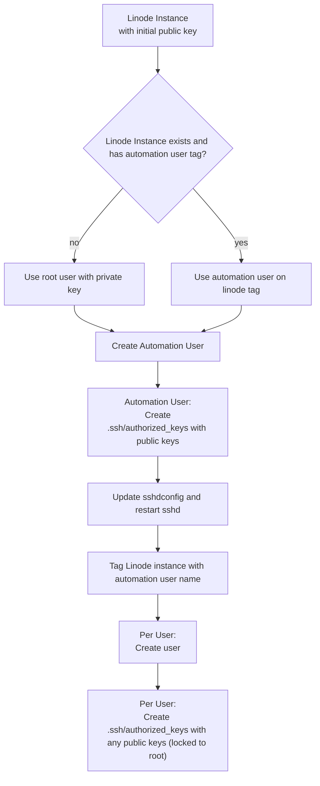

# @hanseltime/pulumi-linode

[API docs](./docs/api)

<!-- [TODO - put your Github Pages url here](TODO) -->

This is a typescript collection of pulumi resources that use SSH and SFTP to establish baseline resources for various Linode
patterns that go beyond the initial configuration of the `@pulumi/linode` provider libraries.

Currently this only supports (deb/ubuntu) ssh shell commands reliably.

## Note about resources

Since this is not an outright provider, this is only guaranteed to work via `npm/yarn/pnpm install` and inclusion in a typescript
project at the moment.

Additionally, since this is exposing ComponentResources that wrap multiple patterns, you will want to be mindful of your resource counts.
One resource from this package means multiple SSH commands, SFTP commands and linode commands.  Keep in mind that pulumic cloud free only allows
200 resources, so if the constructs are using too many of those resources, you will want to use a self-hosted backend.

# Installation

As noted above, this is only guaranteed to work for typescript pulumi projects at the moment.  If you would like to test the pulumi provider
compilation and provide improvements toward that, please feel free.

Install the package and its dependencies:

```shell
# yarn
yarn add @hanseltime/pulumi-linode @pulumi/pulumi @pulumi/linode @pulumi/command

# npm
npm install @hanseltime/pulumi-linode @pulumi/pulumi @pulumi/linode @pulumi/command

# pnpm
pnpm add @hanseltime/pulumi-linode @pulumi/pulumi @pulumi/linode @pulumi/command
```

# Resources

## Linode Instance

The LinodeInstance is a wrapper around the `@pulumi/linode -> Instance` resource.  This resource is preferrable
for a few reasons:

1. SSH Keys are managed without requiring system reboots (this will require a full system reboot with the original resource)
2. User declaration and SSH Key management are declarative
3. An automation user with passwordless sudo privileges is created for additional
   linux style SSH resources without relying on root SSH'ing
4. Allows declarative managing of your sshd configuration
4. Applies [as defaults] some of the [Linode suggested ssh hardening practices](https://techdocs.akamai.com/cloud-computing/docs/set-up-and-secure-a-compute-instance#harden-ssh-access):
   1. Restricting root login after the automation user is set up with ssh keys
   2. Enforcing SSH key only login
5. Declarative support for VLAN network interfaces with ip overlap checks, etc.

For these reasons, we recommend the LinodeInstance and welcomme any additional updates that would make things
more declarative.

### Steps to configure a Linode

When you bring up the `LinodeInstance` component, the following roughly occurs:



A few key points about the above:

1. The Linode Instance is set up via the Linode API BUT needs to have the `initialRootSSHKey`
   and `automationUser.sshKey` hold the same public key for the private key that you have on
   the machine that you are running pulumi up from.  This allows us to smoothly transition to
   using the automation user that we create for all other ssh operations after creating it with root.
2. We make use of Linode tags to track when the automation user is available (i.e. the ssh keys have
   been set up for us to only use that automation user and the sshd config has disabled root login
   by default).
3. This means that there are actually 2 `pulumi up`'s where you will see a change around the automation-user
   ssh commands since, once we have set up the automation user, we switch it's ssh command to use itself
   instead of the root user for connections.

In general, if there is some bug that breaks before the Linode tag is created (unlikely), we would recommend
removing and then recreating a new linode instance rather than troubleshooting the half-state.

### Setting up SSH access

In order to be able to use SSH key access reliably, you will want to have a process where you:

#### 1. Generate ssh key public and private keys

This can look like a script that you, the ops admin, can run to generate keys, like:

```shell 
echo "Creating ssh keys at $SSH_KEY..."
read -s -p "Please provide the ssh password: " SSH_PASSWORD
echo
ssh-keygen -b 2048 -t rsa -f $SSH_KEY -N $SSH_PASSWORD
```

For instance, if you were creating this SSH key for another user to login in, 
you would securely send the private and public key to that user for them to install it 
into their machine's `.ssh` folder.  

Another example woudl be that, in the case of a CICD environment, you would add the private and public key to the environment via something like Github Actions Secrets perhaps and a script to load it into the correct location.

#### 2. Place the public key in a project root local folder

Due to some of the nuances of file comparison's in pulumi, you NEVER want to include a file via an absolute
path.  This is because, you will more than likely find yourself in a spot where you are trying to deploy 
from a local admin computer (maybe just for the initial deployment), and then from a different CICD machine
environment.  Pulumi will try to look up the absolute path on the machine which more than likely will not exist
on the machine due to user name differences.

Because of this, we need to take the public key that we created (not the private key!) and place it in a
folder within the pulumi project repository (for instance, `public_keys`).

```
/myproject
  index.ts
  tsconfig.json
  public_keys/
    my_public_key_rsa.pub
```

#### 3. Reference the public key

Just like with the `@pulumi/linode` Instance, you can then reference the public key:

```typescript
// index.ts
const initialRootKey1 = std
	.file({
        // This is relative to the pulumi cwd
		input: join("public_keys", "my_public_key_rsa.pub"),
	})
	.then((invoke) =>
		std.chomp({
			input: invoke.result,
		}),
	)
	.then((invoke) => invoke.result);
```

and add supply it as the public ssh keys that are accepted for the root + automation user.

```typescript
new LinodeInstance('machine1', {
    // ...Other config
    initialRootKey: initialRootKey1,
    automationUser: {
        sshKeys: {
            name: 'cicd_key',
            key: initialRootKey1,
        }
    }
})
```

#### 4. Load in the your private key from the environment

In order for us to actually execute the SSH commands after the linode instance is brought up, we will need
to load in the private key that corresponds to the public key that we have loaded to the root and
automation user.  It is up to you to load the private key in to whatever location you deem fit for your machine.

In this example, I have my private and public key store in my local `~/.ssh/` folder.

```typescript
const deployPrivateKey = pulumi.secret(
	readFileSync(
		join(
			homedir(),
			".ssh",
			"my_public_key_rsa",
		),
	).toString(),
);
```

And then we would use it as part of the LinodeInstance connection arguments:

```typescript
new LinodeInstance('machine1', {
    // ...Other config
    initialRootKey: initialRootKey1,
    automationUser: {
        sshKeys: {
            name: 'cicd_key',
            key: initialRootKey1,
        }
    }
    // This is for connecting for our commands
    sshKey: deployPrivateKey,
	sshKeyPassword: config.requireSecret("sshPassword"),
})
```

Note that we enforce you to always add the additonal element of an sshkey password for your private keys for the
automation user.  This is partly since an automation user does not have to log in to use sudo.

### Example - Basic configuration - SSingle Public Linode

In the simplest configuration, you may just want to set up a Linode Instance with a public ip.

This example assumes you've set up the SSH keys as discussed previously.

Additionally, you can see that we set up a number of configuration secret values for us to control
linux user passwords.  This means that, as the ops admin with access to the pulumi secret keys, you 
are running a command like so and then committing it:

```shell
pulumi config set rootPassword --secret
```


```typescript
const config = new pulumi.Config();

// SSH Keys
const initialRootKey1 = std
	.file({
        // This is relative to the pulumi cwd
		input: join("public_keys", "my_public_key_rsa.pub"),
	})
	.then((invoke) =>
		std.chomp({
			input: invoke.result,
		}),
	)
	.then((invoke) => invoke.result);

const deployPrivateKey = pulumi.secret(
	readFileSync(
		join(
			homedir(),
			".ssh",
			"my_public_key_rsa",
		),
	).toString(),
);

// Additionally, let's pretend that our 1 ops admin will have a private key to login
const adminJohnPubKey = std
	.file({
        // This is relative to the pulumi cwd
		input: join("public_keys", "admin_john_rsa.pub"),
	})
	.then((invoke) =>
		std.chomp({
			input: invoke.result,
		}),
	)
	.then((invoke) => invoke.result);

// END SSH Keys

const instance = new LinodeInstance("machine1", {
	label: "machine1",
	// Can be found by running linode-cli images list --json
	image: "linode/ubuntu24.10 ",
	region: REGION,
	// Can be found by running linode-cli linodes types --json
	type: "g6-nanode-1",
	rootPass: config.requireSecret("rootPassword"),
	initialRootKey: initialRootKey1,
	sshKey: deployPrivateKey,
	sshKeyPassword: config.requireSecret("sshPassword"),
	automationUser: {
		password: config.requireSecret("automationUserPassword"),
		sshKeys: [
			{
				name: "cicd_key",
				key: initialRootKey1,
			},
		],
	},
	nonRootUsers: {
        // Add a user that ops admins can use to troubleshoot the linode
		opsAdmin: {
			password: config.requireSecret("opsAdminPassword"),
			groups: ["sudo"],
			sshKeys: [
				{
					name: "john-access",
					key: adminJohnPubKey,
				},
			],
		},
	},
	tags: [],
	// no vlan for this example, but it would be more secure if you could keep things in a vlan
});
```

**About the above**

From the declaration above we did a few things:

1. We have a Linode that will have an automation user with a randomly generated name and the same ssh access as the initial
    root user
2. We have an additional user for our Ops admin (Presumably John), that has the public key for John's corresponding private 
   key
3. The other properties (aside from SSH properties), are normal Linode Instance configuration options.

#### Adding Firewalls

The most basic configuration above does not have any firewall rules set up.  In general, you'll want those, and there are 
a few ways that you can do so with a Linode.

The Linode Cloud way to add a firewall is to create a `Firewall` resource and then add that id to your Linode's `firewallId`
property.

**IMPORTANT!** If you are going to use docker on your Linode, we do not recommend using the Firewall object since it only 
controls firewall rules at the UFW layer and is bypassed by Docker networking rules.  

The recommended way to add your own firewall rules is to use the `@hanseltime/pulumi-linux-iptables` resources to maintain a
declarative set of iptables rules.  If you are going to use `@hanseltime/pulumi-docker`, there is a good example for how
to apply firewalls to your Docker ports and your machine instance.

A nominal iptables example that has an empty blacklist for ipv4 and ipv6 would look like so:

```typescript
const instance = new LinodeInstance(/* Your Instance details */)

// Start Create firewall resources
const ipTablesInstall = new IpTablesInstall(
	"iptables-install",
	{
		connection: instance.automationUserConnection,
	},
	{
		dependsOn: [instance],
	},
);
const ipv4BlacklistSet = new IpSetResource(
	"ipv4-blacklist",
	{
		connection: instance.automationUserConnection,
		ipSet: globalBlockIpSetIpv4,
	},
	{
		dependsOn: [instance, ipTablesInstall],
	},
);

const ipv6BlacklistSet = new IpSetResource(
	"ipv6-blacklist",
	{
		connection: instance.automationUserConnection,
		ipSet: globalBlockIpSetIpv6,
	},
	{
		dependsOn: [instance, ipTablesInstall],
	},
);

// These are the normal chains on the linode - they cover all non-docker firewalls
const baseRules = {
	rulesIpV4: [blacklistV4],
	rulesIpV6: [blacklistV6],
};
const forwardIpTablesChain = new IpTablesChain(
	"forward-chain",
	{
		name: "FORWARD",
		table: "filter",
		connection: instance.automationUserConnection,
		alreadyCreated: true,
		...baseRules,
	},
	{
		dependsOn: [ipv4BlacklistSet, ipv6BlacklistSet],
	},
);
const inputIpTablesChain = new IpTablesChain(
	"input-chain",
	{
		name: "INPUT",
		table: "filter",
		connection: instance.automationUserConnection,
		alreadyCreated: true,
		...baseRules,
	},
	{
		dependsOn: [ipv4BlacklistSet, ipv6BlacklistSet],
	},
);
// End Firewall rules

// Make sure that we persist the configuration from these chains
new IpTablesSave(
	"save-config",
	{
		connection: instance.automationUserConnection,
		ipTablesResources: [
			ipv4BlacklistSet,
			ipv6BlacklistSet,
			forwardIpTablesChain,
			inputIpTablesChain,
			dockerInstall.dockerUserIpTablesChain,
		],
	},
	{
		dependsOn: [instance],
	},
);
```

### Example - internally networked linodes

In this example, let's say that you are trying to set up a single load balancing machine on a public IP
and then two linodes that will be connected to via an internal VLAN.

```typescript
const privateVlan = new VLAN("private-network", "10.0.0.0/24");

const config = new pulumi.Config();

// SSH Keys
const initialRootKey1 = std
	.file({
        // This is relative to the pulumi cwd
		input: join("public_keys", "my_public_key_rsa.pub"),
	})
	.then((invoke) =>
		std.chomp({
			input: invoke.result,
		}),
	)
	.then((invoke) => invoke.result);

const deployPrivateKey = pulumi.secret(
	readFileSync(
		join(
			homedir(),
			".ssh",
			"my_public_key_rsa",
		),
	).toString(),
);

// Additionally, let's pretend that our 1 ops admin will have a private key to login
const adminJohnPubKey = std
	.file({
        // This is relative to the pulumi cwd
		input: join("public_keys", "admin_john_rsa.pub"),
	})
	.then((invoke) =>
		std.chomp({
			input: invoke.result,
		}),
	)
	.then((invoke) => invoke.result);

// END SSH Keys

// Note, different passwords per machine is advisable but we don't do that here
const sharedInstanceOptions = {
    initialRootKey: initialRootKey1,
	sshKey: deployPrivateKey,
	sshKeyPassword: config.requireSecret("sshPassword"),
	automationUser: {
		password: config.requireSecret("automationUserPassword"),
		sshKeys: [
			{
				name: "cicd_key",
				key: initialRootKey1,
			},
		],
	},
}
const opsAdminUsers = {
    // Add a user that ops admins can use to troubleshoot the linode
    opsAdmin: {
        password: config.requireSecret("opsAdminPassword"),
        groups: ["sudo"],
        sshKeys: [
            {
                name: "john-access",
                key: adminJohnPubKey,
            },
        ],
    },
}

const loadBalancerInstance = new LinodeInstance("load-balancer", {
    ...sharedInstanceOptions,
	label: "load-balancer",
	// Can be found by running linode-cli images list --json
	image: "linode/ubuntu24.10 ",
	region: REGION,
	// Can be found by running linode-cli linodes types --json
	type: "g6-nanode-1",
	nonRootUsers: {
        ...opsAdminUsers,
	},
	tags: [],
    vlan: {
        network: privateVlan,
        ip: "10.0.0.1",
    }
	// no vlan for this example, but it would be more secure if you could keep things in a vlan
});

const internalInstance = new LinodeInstance("internal1", {
    ...sharedInstanceOptions,
	label: "internal1",
	// Can be found by running linode-cli images list --json
	image: "linode/ubuntu24.10 ",
	region: REGION,
	// Can be found by running linode-cli linodes types --json
	type: "g6-nanode-1",
	nonRootUsers: {
        ...opsAdminUsers,
	},
	tags: [],
    vlan: {
        network: privateVlan,
        ip: "10.0.0.2",
    }
})

const internalInstance2 = new LinodeInstance("internal2", {
    ...sharedInstanceOptions,
	label: "internal2",
	// Can be found by running linode-cli images list --json
	image: "linode/ubuntu24.10 ",
	region: REGION,
	// Can be found by running linode-cli linodes types --json
	type: "g6-nanode-1",
	nonRootUsers: {
        ...opsAdminUsers,
	},
	tags: [],
    vlan: {
        network: privateVlan,
        ip: "10.0.0.3",
    }
})

// TODO - your firewalling and setting up remote commands, etc. to deploy the load balancer and services etc.
```

Without considering the setting up of the firewalls and any commands for a load balancer, we can make a few observations:

1. We share the same automation and root SSH Keys for all instances since the same automation needs to connect to each
2. We can reuse our opsAdmin user since we probably want the same troubleshooting access on each linode
3. Each machine belongs to the `10.0.0.0/24` internal vlan and each has its own ip in the space (i.e. `10.0.0.3`)
     This means that you can connect to `internal2` from `internal1` or the `load-balancer` by `10.0.0.3` and avoid public internet.

#### Security - making internal machines internal only

TODO 

## Helper Class VLAN

If you have found yourself in a linode data center, you may have also started your journey without realizing that
VPCs are only allowed in certain data centers (at least for this moment).  This does not mean that you cannot privately network machines within the same data center though!

Instead, you have to declare and maintain VLAN network interfaces for each machine you intend to add in your
account for a given data center.  [Relevant linode vlan setup article](https://techdocs.akamai.com/cloud-computing/docs/getting-started-with-vlans)

To simplify some of the hurdles like tracking what IPs are taken, and ensuring all the same CIDRs are used
across machine network interfaces, we provide the helper VLAN class, where you can declare your networking
intentions.

```typescript
// Create a vlan that covers 256 addresses - probably want it bigger
const privateVlan = new VLAN("private-network", "10.0.0.0/24");

new LinodeInstance('machine1', {
    // Other options
    vlan: {
        netowrk: privateVlan,
        ip: "10.0.0.1",
    }
})
```

The Vlan class has some locking features to it's retrieval methods, so in general, all you need to do is 
set up your VLAN's CIDR range, and then pass it to LinodeInstance.  The instances (as long as they are all
in the same project), will throw an error if you reserve the same ip address for a machine on the network.

