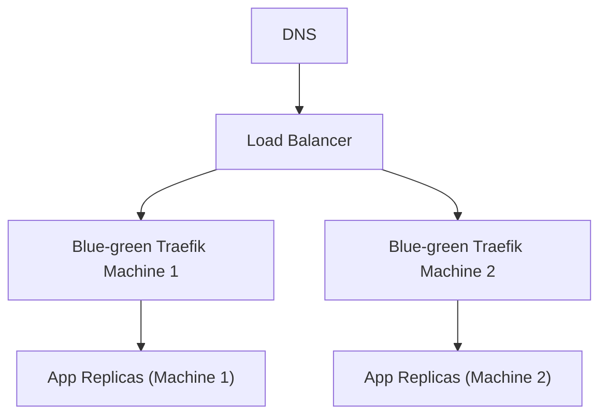

# @hanseltime/pulumi-docker-deploy
<!-- TODO - look at doing mkdocs in the monorepo -->

# docker-deploy

This package supports rudimentary containerization on a linux machine (currently only deb/ubuntu) with bash as its shell.  
This will allow you, via SSH to any linux box you have set up, to:

1. Install docker and it's dependencies on the machine
   1. Install docker plugins (with a rollout plugin pre-installed for blue-green deployment)
2. Run a traefik reverse-proxy entrypoint for blue/green deployment on your machine
3. Run isolated docker-compose services that can either be built on the server or use pre-built images and be deployed via
   a downtime replacement or a blue-green pattern via the traefik reverse proxy.

In effect, this allows you to run an EC2, Linode, etc. with containerization as your application deployment method.  This only orchestrates things
at a per-machine level and is not designed (like Kubernetes) to automate multi-machine orchestrated deployments.  Instead you get IAC that documents
what is on each machine and are responsible to update that IAC manually.

Important: Currently these resources set up rooted Docker and are still reliant on you doing your own security assesssment.  Please see [Security](#security) to understand if you can use this.

## Why these pulumi resources?

You may be asking yourself, "why wouldn't I just use Kubernetes?".  That is the right question!

If you have the time and resources, I recommend that you use Kubernetes from the start.  Kubernetes, while more complex,
is also more scalable, automatic, and robust.

These resources exist for the small scale/resources cases.  If you are already comfortable with docker compose and the idea of SSH'ing
onto servers to turn things on/off while the idea of kubernetes is not familiar to you, then this allows you to start using containers
on any server that you own while only slightly expanding your learning from a docker compose base.

Additionally, this resource may help you understand the inner workings of kubernetes better, since it is basically a very raw initial
idea of automatic container deployment.  Since you will be responsible for writing pulumi code to deploy containers to multiple machines
and keep track of many of the things that kubernetes does for you, it may help you get a feel for how non-magical k8s is under the hood.

# Installation

Right now this is only guaranteed to work for typescript pulumi projects at the moment.  If you would like to test the pulumi provider
compilation and provide improvements toward that, please feel free.

Install the package and its dependencies:

```shell
# yarn
yarn add @hanseltime/pulumi-linux-docker @pulumi/pulumi @pulumi/command

# npm
npm install @hanseltime/pulumi-linux-docker @pulumi/pulumi @pulumi/command

# pnpm
pnpm add @hanseltime/pulumi-linux-docker @pulumi/pulumi @pulumi/command
```

### Warning about pulumi resource count

This library is currently a composite library.  That means that we are chaining smaller SSH and SFTP resources from the `@pulumi/command`
library into our exposed resources.  While we have tried to keep resource counts down, while leveraging pulumi's diff capabilities, you will
end up with ~8 resources per docker compose service and ~16 for a docker install.  If you are using pulumi's free tier, please budget accordingly.

Keep in mind that you can always switch to a self-hosted solution if you would like to avoid billing.  You can also try to bring up some of
the example projects in this package's monorepo and verify the number of resources to make a more informed decision.

### Example: A developer who might want to use docker compose

Let's say you are trying to start modernizing an old website that has been slowly degrading over the years.  You may have 1 or 2 EC2's 
that your company hosts their server and database on and all of it was set up without any notes as to settings or steps to repeat in the
event of a disaster recovery.  This probably also means that you don't really have the luxury of immediately spinning up a local version 
of the site to develop against.

When you start this upgrade project, you want to avoid the mistakes of the past, so you create Dockerfiles for the database, the 
old website, and the new API that you are going to start migrating critical functions to.  With that set up, you just want to be able to commit 
those dockerfiles and push them to the server without having to deconstruct the entire base `mysql:7.3` image into its component parts or the entire `node:22` base image respectively and then set up a set of shell commands to run on a server to match what you figured out when setting up
a local containerized environment.  Really, you want the benefits of containerization!

This is when you think to yourself that you just want to be able to set up some pulumi resources that look something like:

```typescript
// Pulumi connects to each machine
const machine1Connection;
const machine2Connectionn;
const machine3Connection;

// We set up just a single master db on machine1 for now (none of the legacy apps were set up for replicas)
const database = new DockerComposeService('db-on-1', {
   connection: machine1Connection,
   name: 'legacy-db',
   build: allTheAssetsForMyDockerfile,
   // This means don't push any replace changes UNLESS you have scheduled downtime!
   deployType: DockerDeployType.Replace,
   ports: [3306],
   secrets: {
      // Root and database user secrets
   }
   // Additional properties
})
// Set up the api on machine 2
const apiOnMachine2 = new DockerComposeService('api-on-2', {
   connection: machine2Connection,
   name: 'api',
   build: allTheAssetsForMyDockerfile,
   secrets: {
      // If you wanted, you could mount the db user secrets here
   },
   deployType: DockerDeployType.BlueGreen,
   deploy: {
      // We want 2 apis running on the machine
      replicas: 2,
   },
   bluegreen: {
      networkName: dockerInstall.blueGreenNetwork,
      ports:[
         {
            // all of our traffic for blue-greeen is routed via the api/v2 prefix
            entrypoint: 'web',
            local: 3000,
            rules: [TraefikRouteRule.pathPrefix('/api/v2')],
            healthCheck: {
               path: '/health',
            }
         }
      ]
   }
   // Additional properties
})
// Set up an additional 2 api replicas on machine3 and then we'll have some load balancer to route to both of them
const apiOnMachine2 = new DockerComposeService('api-on-2', {
   connection: machine3Connection,
   // Exact same configuration as api 1 (probably put it into a variable)
})
// Set up the legacy server on machine 1 with 2 nodes
const apiOnMachine2 = new DockerComposeService('legacy-on-2', {
   connection: machine2Connection,
   name: 'legacy-server',
   build: allTheAssetsForMyDockerfile,
   ports: [3306],
   secrets: {
      // If you wanted, you could mount the db user secrets here
   },
   deployType: DockerDeployType.BlueGreen,
   deploy: {
      // We want 2 legacy server containers running on the machine
      replicas: 2,
   },
   bluegreen: {
      networkName: dockerInstall.blueGreenNetwork,
      ports:[
         {
            // legacy gets all other paths expect the api/v2 path
            entrypoint: 'web',
            local: 3000,
            rules: [TraefikRouteRule.pathPrefix('/api/v2', TraefikRuleOp.Not)],
            healthCheck: {
               path: '/health',
            }
         }
      ]
   }
   // Additional properties
})
```

So what do we gain from something like that?

In general, we now have clear declarations of services and where they live (i.e. which machines they're on).  Additionally,
whenever we change the assets that are linked for building, we know that the pulumi resource should upload the new build files and
in the case of the `api` and `legacy-server`, will blue-green deploy them through a local reverse proxy on the machine.

We can also see that our database has a deploy strategy of replacement, which makes sense since you don't want to continue writing
to one db while another one comes up due to consistency issues.  This means that any time we trigger a replace on the element, we will
want to make sure it has a downtime window where no data is being written so that the replace does not lose writes.

So now we have the ability to:

1. Define our services via container (which allows for local replication and testing)
2. Use docker compose service declaration to do all things that docker compose does
   1. i.e.
      1. secrets
      2. volumes
      3. replication
      4. container health checks
3. Specify deployment options
   1. Blue-green (automated zero-downtime via a reverse proxy)
   2. Replacement (downtime during the down and up of the containers)
4. Wire these deployments individually to any machine that we can SSH to

## Resources

This package really just exposes 2 Component Resources that are meant to be deployed in order:

1. 1 DockerInstall per machine
2. N number of DockerComposeServices on the machine

### DockerInstall

If you are hoping to use this library, we recommend that you always install docker via the DockerInstall resource.

The resource will:

1. Perform apt installs of Docker tools
2. Upload any daemon.json configuration and restart the docker instance if there was a change
   1. At minimum, we require you to specify your docker default network CIDR so that you are aware of the ip spaces on your machine
3. Add the docker-rollout plugin (supplied in this package) for blue-green release
4. Manage the `DOCKER-USER` iptables chain by a firewall field since it is not managed by tools like ufw and can be a security risk
5. Spin up a traefik reverse-proxy for any blue-green operations on a few entrypoints
   1. The traefik instance will already be configured for a docker provider to monitor traefik labels on services
   2. The traefik instance will have its own network that all other services will need to use so that they can be routed to through it

In general, all blue-green networking will involve using [Traefik settings](https://doc.traefik.io/traefik/) and should be set up according to your own needs.

#### How Blue-Greening works (routing)

The expected/recommended blue-green ecosystem is something like:



Importantly, keep in mind that the blue-green reverse proxy is not meant to be your load balancer outside of blue-greening
the `App` on its `Machine`.  The Load balancer at the top may also be Traefik, HAProxy, AWS ALB, etc. and that will have more
aggressive networking (i.e. http host or path redirection to ALL IP addresses that have X app on them).

The following are some common scenarios for networking to your applications and how you would set up the `DockerInstall`:

##### Example 1 - unencrypted traffic

This example is the simplest example and should only be supported if:

1. Your load balancer is enforcing TLS (to make sure that web clients are secure)
2. Your communication between load balancer and machines is on a private secured network
3. You do not have a requirement for in-network encryption to terminate at the application

This will basically say that we open up an entrypoint that takes raw http on port :80 (all network interfaces) and proxies it to the compose services
behind it.  Your load balancer will need to be terminating TLS and passing http it to the blue-green traefik instances on port 80 on each machine.

```typescript
new DockerInstall('machine1-docker-installation', {
      connection,
      homeDir,
      tmpCopyDir: "./tmp",
      // Networking properties
      // Firewall properties
      blueGreen: {
         staticConfig: {
            entryPoints: {
               web: {
                   // Note: dockinstall automatically exposes all ports for entrypoints (i.e. 80:80).  
                   // It respects if a host is provided (i.e. 127.0.0.1:80:80)
                  address: ':80', 
                  http: {},
               },
            }
         }
      }
   },
)
```

Any docker service that is behind this type of blue-green setup would need to use the same entrypoint that was specified in the DockerInstall
configuration (`web`):

```typescript
   new DockerComposeService(
        "machine1-server-container",
        {
            name: "server",
            connection,
            homeDir,
         // Service config
         // Other options
            blueGreen: {
            // Have to connect to the blue green network - if in another project, use the correct string
                networkName: dockerInstall.blueGreenNetwork,
                ports: [
                    {
                  // The entrypoint we configured via traefik
                        entrypoint: "web",
                  // The port locally on the container that we want to bind to
                        local: 3000,
                  // Basically put all paths to this service - this would only work if we only had this on the machine
                        rule: TraefikRouteRule.pathPrefix("/"),
                  // The health check
                        healthCheck: {
                            path: "/",
                        },
                  // Do not expect a tls endpoint from "web"
                        tls: false,
                    },
                ],
            },
        },
        {
            dependsOn: [dockerInstall],
        },
    );
```

We discuss the DockerComposeService in another section in further detail.  For now, you can keep in mind that
the construct is basically constructing Traefik docker provider labels under the hood through this `ports` configuration.

##### Example 2 - TLS termination at blue-green server

This example is a safer compromise between application TLS termination and unencrypted access.

This might be useful if you:

1. Need to ensure encryption between load balancer and machines
2. You don't have a security requirement for encrypted traffic over the docker network between containers

The following example assumes that we have our certificate file and private key and are comfortable with pulumi's secret
encryption to use them as secrets in our repo.

This would mean that as an Ops Admin, I pulled the keys from our secrets store and then created pulumi secrets by something like:

```shell
# assumes the files are on the local machine (do not commit!)
cat cert.crt | pulumi config set certcrt --secret
cat private.key | pulumi config set certkey --secret
```

With those secrets in tow, we mount the keys via compose secrets and provide a dynamic configuration.

```typescript
new DockerInstall('machine1-docker-installation', {
      connection,
      homeDir,
      tmpCopyDir: "./tmp",
      // Networking properties...
      // Firewall properties...
      blueGreen: {
         staticConfig: {
            entryPoints: {
               web: {
                  address: ":80",
                  http: {
                     redirections: {
                        entryPoint: {
                           to: "websecure",
                           scheme: "https",
                        },
                     },
                  },
               },
               websecure: {
                  address: ":443",
               },
            },
            providers: {
               file: {
                  directory: "/etc/traefik/dynamic",
               },
            },
         },
         // Note, in this case, we would require a reload on certs since secrets do require a replace
         //   We could also come up with volume mounting if we wanted a rolling update
         secrets: [
            {
               name: "cert.crt",
               value: config.require("certcrt"),
            },
            {
               name: "cert.key",
               value: config.require("certkey"),
            },
         ],
         mounts: [
            {
               // Per traefik, use a directory for reloads to not be missed
               name: "dynamic",
               onContainer: "/etc/traefik",
               resource: new pulumi.asset.AssetArchive({
                  "tls.yml": new pulumi.asset.StringAsset(
                     dump({
                        tls: {
                           options: {
                              default: {
                                 minVersion: "VersionTLS12",
                              },
                           },
                           certificates: [
                              {
                                 certFile: "/run/secrets/cert.crt",
                                 keyFile: "/run/secrets/cert.key",
                              },
                           ],
                        },
                     }),
                  ),
               }),
            },
         ],
      },
   },
)
```

About the above:

1. You can see that we have set up a traefik static config that:
   1. Reroutes all :80 requests to :443 to enforce TLS
   2. Has a `websecure` entrypoint that listens on :443
   3. Has a file provider that tells traefik to look for any dynamic config yaml files in `/etc/traefik/dynamic`
2. To complement our traefik static configuration, we have loaded our 2 secrets in as docker compose secrets
   1. Per the compose secrets behavior, we can expect them at `/run/secrets/<name>`
3. Finally, we have mounted a directory called `dynamic` that is mapped to `/etc/traefik` that has a `tls.yml` traefik dynamic configuration
   1. The `tls.yaml` file is pointing to the secrets that we mounted for private key and certificate chain

**Note:** If you do not want downtime when rotating tls certificates, you could instead make use of mounts, which would map
a `./mnt/` location into the container with the certificates and would not require restarting the process when they were changed

Any docker service that is behind this type of blue-green setup would need to use the same entrypoint that was specified in the DockerInstall
configuration  (`websecure`):

```typescript
   new DockerComposeService(
        "machine1-server-container",
        {
            name: "server",
            connection,
            homeDir,
         // Service config
         // Other options
            blueGreen: {
            // Have to connect to the blue green network - if in another project, use the correct string
                networkName: dockerInstall.blueGreenNetwork,
                ports: [
                    {
                  // The entrypoint we configured via traefik
                        entrypoint: "websecure",
                  // The port locally we want to bind to
                        local: 3000,
                  // Basically put all paths to this service - this would only work if we only had this machine
                        rule: TraefikRouteRule.pathPrefix("/"),
                  // The health check
                        healthCheck: {
                            path: "/",
                        },
                  // Required - without this it will 404
                        tls: true,
                    },
                ],
            },
        },
        {
            dependsOn: [dockerInstall],
        },
    );
```

We discuss the DockerComposeService in another section in further detail.  For now, you can keep in mind that
the construct is basically constructing Traefik docker provider labels.

###### Notes about TLS termination at the machine instead of the load balancer: 

There are two main options for TLS termination at the machine:

1. You could terminate TLS at the top-level load balancer for your public certificate and then use an internal TLS certificate that the blue-green proxies
   use between the top-level load balancer and the blue-green instances.  This would have the benefit of leaving your response scaling
   to the entrypoint load balancer only, which might be what you want if you're worried about something like SSL DoS attacks.. This does add 
   additional overhead by way of an additional SSL encryption between the load balancer and service.

2. The second option would be to make sure that your load balancer does not terminate the TLS connection and instead your
   traefik blue-green connections terminate it. 

**Warning about TLS certificate auto-renewal:** If you do not have a single termination point for your TLS, you will want to make sure that
you do not perform certificate renewal with every traefik instance via acme.  This will end up with different SSL certs on
every machine and, depending on your CA, may end up invalidating the other certificates!  Instead, you will want to set up 
something like an `http` traefik provider for your blue-green server (ideally using an Object store backing for resiliency) that 
has your certificates and then add some sort of job or application that runs to renew it, or even just update pulumi mounted resources
with the same certificates.

##### Example 3 - TLS termination at application servers

If you were to set up traefik to pass through TLS to the application container, you would want to follow something like 
[here](https://community.traefik.io/t/traefik-v3-cannot-get-tls-passthrough-to-work/23201/5).

**IMPORTANT** the DockerComposeService interface for ports does not yet enforce this type of passthrough (please feel free to contribute it!),
so you will want to add your own traefik labels for a tcp (not http) router:

```typescript
   service: {
      labels: [
         "traefik.enable=true",
         "traefik.tcp.routers.myapp.entrypoints=websecure",
         "traefik.tcp.routers.myapp.rule=HostSNI(`*`)", // Some tcp router rules
         "traefik.http.routers.myapp.tls=true",
         "traefik.http.routers.myapp.tls.passthrough=true", // Add this to enforce passthrough
         "traefik.http.services.myapp.loadbalancer.healthCheck.path=/",
         "traefik.http.services.myapp.loadbalancer.server.port=3000"
      ]
   }
```

This last example shows how you can always add more custom behavior for your docker compose service if the `blueGreen.ports` interface is
not enough!  And as always, if you do get a pattern, please feel free to contribute additional strongly typed structures.

#### Networking

If you've previously just used a default docker installation and set up docker compose, you may be unaware that docker uses some default
IP addresses for its default and additional networks (like ones you declare in docker compose).

In general, the default bridge is assigned to "172.17.0.1/16" and then additional networks are created at /16 intervals incrementing from that.

This does mean that you can run into IP collisions if you have something like a VLAN or VPN that your machine is attached to.

As an example, let's say that you are part of a network that has 172.19.0.0/16 IP space.  The first 2 networks that you create will not overlap,
but then on your third network, docker will now have an overlapping IP space that can start getting IP collisions with machines on the network.
The simplest way to solve this is to explicitly declare the IPs that each docker network can use - which is what we enforce through this construct.

##### The blue green network

From the above TLS examples, it should be clear that we recommend using the blue-green network as the main ingress into all docker containers 
(:80 and :443).  You can still create containers with exposed ports (that would then have their own network or the default network) if you would like
to avoid the overhead of going through the traefik proxy for some non-blue-green service.  However, we recommend using traefik to enforce standard 
networking rules and ingresses.

The blue green network (and really any network you declare for a service), should have enough IPs available for all of 
`2 * services * their replicas + 2 for the gateway + broadcast`  that you expect to have within that network.  This allows for you 
to blue-green deploy every service at once, since blue-greening involves doubling the scale of the service and then removing the old containers.

For the blue-green network in particular, you also need to account for the traefik container (+1).

```typescript
new DockerInstall('machine1-docker-installation', {
      connection,
      homeDir,
      tmpCopyDir: "./tmp",
      // Firewall properties
      // blue green properties
      networking: {
         // In reality, this can be lower unless you plan on attaching lots of things to the default network - for blue-green we don't use the default network
         default: "172.17.0.1/16",
         // This allows for ~254 IPs since the gateway and traefik will take 2
         // This means that we should only have a maxof 126 apps @ 1 replica to allow for blue-greening all at the same time
         blueGreen: "172.18.0.1/24",
      },
   },
)
```

#### Firewall

**!!Running Docker on Linux means that any port that you expose is not subject to your machine's UFW rules!!**

This is a known limitation of docker and is well-documented [here](https://docs.docker.com/engine/network/packet-filtering-firewalls).

Because of this, we enforce that you explicitly need to define who is allowed to access docker ports that are exported.  While it 
might feel like more work, this is actually the safest way to ensure that you are aware of what level of risk your docker system is 
exposing, and there are also strongly typed interfaces to help you get a grasp on iptables.

The `DockerInstall` resource uses types and the `IpTablesChain` resource from the `@hanseltime/pulumi-linux` package.
We encourage you to actually set up your linux machine with all of `hanseltime/pulumi-linux` and `hanseltime/pulumi-linux-iptables`'s resources so that you don't lose 
iptable configuration on reboots, etc. (See its documentation).  Because the resources are usable within your normal Linux iptables that Docker
isn't bypassing, using `@hanseltime/pulumi-linux` also means that you can keep a set of "firewall" configurations that you can then reuse for
both the normal host iptables configuration and to the docker firewall as well.

##### Example - Global Block IPs

This assumes that you have installed all the tools with `IpTablesInstall` so that `ipset` is available for us to store hash maps of blacklisted IP addresses.

__ipTablesConfig.ts__
```typescript
// The are just configurations in this file so we can use it in firewall for the machine and docker
// No resources are created yet - these are just config objects
export const globalBlockIpSetIpv4 = IpSet.HashIp("GLOBAL_BLOCK_IPV4", {
   family: "inet",
});
export const globalBlockIpSetIpv6 = IpSet.HashIp("GLOBAL_BLOCK_IPV6", {
   family: 'inet6',
}).add("c20a:3d44:a867:a8c6:bfb5:bf97:992a:a074"); // We have one bad ipv6 - realistically it would probably be a CIDR

// Make rules for v6 and v4 to reference the ipsets
export const globalBlockDropV4: IpV4TablesRule = {
   jump: 'DROP',
   matchingModule: {
      set: globalBlockIpSetIpv4.matchArgs(['src'])
   }
};
export const globalBlockDropV4: IpV6TablesRule = {
   jump: 'DROP',
   matchingModule: {
      set: globalBlockIpSetIpv6.matchArgs(['src'])
   }
};
```

__index.ts (main pulumi entrypoint)__

```typescript
import { globalBlockIpSetIpv4, globalBlockIpSetIpv6, globalBlockDropv4, globalBlockDropv6 } from './__ipTablesConfig';

// Make sure iptables tools are installed for ipsets and persisting configs on reboot, etc.
const iptablesInstallation = IpTablesInstall('machine1', {
   connection: machine1Connection,
})

// Create our ipsets for chains to be able to use them
const ipv4GlobalBlockSet = new IpSetResource('global-block-v4', {
   connection: machine1Connection,
   ipSet: globalBlockIpSetIpv4
}, {
   dependsOn: [iptablesInstallation]
})
const ipv6GlobalBlockSet = new IpSetResource('global-block-v6', {
   connection: machine1Connection,
   ipSet: globalBlockIpSetIpv6
}, {
   dependsOn: [iptablesInstallation]
})

// Apply our block list to our standard FORWARD and INPUT chains
const inputChain = new IpTablesChain('input-chain', {
   connection: machine1Connection,
   name: 'INPUT',
   table: 'filter',
   ipv4Rules: [globalBlockDropV4],
   ipv6Rules: [globalBlockDropV6]
}, {
   dependsOn: [ipv4GlobalBlockSet, ipv6GlobalBlockSet]
})
const forwardChain = new IpTablesChain('forward-chain', {
   connection: machine1Connection,
   name: 'FORWARD',
   table: 'filter',
   ipv4Rules: [globalBlockDropV4],
   ipv6Rules: [globalBlockDropV6]
}, {
   dependsOn: [ipv4GlobalBlockSet, ipv6GlobalBlockSet]
})

const installation = new DockerInstall('machine1-docker-installation', {
      connection: machine1Connection,
      homeDir,
      tmpCopyDir: "./tmp",
      // networking properties
      // blue green properties
      firewall: {
         ipv4: [globalBlockDropV4],
         ipv6: [globalBlockDropV6],
      }
   },
   {
      dependsOn: [ipv4GlobalBlockSet, ipv6GlobalBlockSet]
   }
)

// Save the configuration for it to persist on reboots - will whenever any of the resources change
new IpTablesSave('machine1-persist-iptables', {
   connection: machine1Connection,
   ipTablesResources: [installation.dockerUserIpTablesChain, forwardChain, inputChain]
})
```

**Breaking down the above:**

__ipTablesConfig.ts__ - we set up a config file where we use strongly typed interfaces to write out configurations
for iptables rules.  Particularly, we expect a global block list ipset for ipv4 and ipv6 and then we want to have a rule
that checks the ipv4 set for ipv4 connections and the ipv6 set for ipv6 connections.  This gives us an easy configuration location
where we can add new ip addresses or even rules that we can import into multiple iptable chains.

__index.ts__ - This is our assumed entrypoint for the pulumi program that we're writing.  It shows the best practice of:

1. First creating `IpTablesInstall` so that all other iptables resources will work
2. Then creating our `IpSetResources` from the configuration `IpSet` objects so that iptables rules can be find them when added
3. Then setting up our normal host's INPUT and FORWARD filter chains with our block rules from config
   1. Note - applying a global block to forward is good practice in case forwarding is somehow turned on later
4. We can also set up our `DockerInstall` firewall now since the rules we're using require the ipset which has been made
5. Finally, we create the `IpTablesSave` resource, which will dump any config to reloadable files to persist the config on reboot

As you can see fromm the `IpTablesSave` properties, the docker installation resource creates (and therefore manages) the DOCKER-USER chain
that docker created (`installation.dockerUserIpTablesChain`).  This means that ALL DOCKER-USER rules should be applied to this resource and 
nowhere else, or they will be removed whenever there is an update to these firewall rules.

###### A note about rule ordering

Obviously, a single global blocklist is probably not enough for your firewall.  Additionally, you will want to consider ordering of the firewall rules.
Since rules are evaluated in the order they appear in the array. All of this is rehashed in the `@hanseltime/pulumi-linux` documentation on the 
iptables resources, but if you had more than one 1 rule in these chains, you would want your global block rule to be all the way at the beginning so 
that you immediately bounce bad actors.

##### Example - Internal network only for a db

Let's say that you have configured `eth0` to be your public internet network interface and `eth1` to be a VLAN network interface.  (You can look at
your network interfaces via `ifconfig`).  Now let's say that you know that you are going to expose a database on port `4567` and that you only want
the database to be accessible inside the docker network and the VLAN (no public access).

Important - you almost ALWAYS want to add an `inInterface` option to any rules that might DROP in the `DockerInstall` firewall.  This is because
docker also traverses its own bridge network interfaces and might get its responses blocked as well if you include those interfaces for things like
"all but X" ip based DROP.

__ipTablesConfig.ts__
```typescript
// Other rules... above
export const noInternetTrafficToDbPortTcp: IpV4TablesRule | IpV6TablesRule = {
        jump: 'DROP',
        inInterface: 'eth0', // Our public internet interface we have set up on the machine - there may be more like wlan
        protocol: 'tcp',
        destinationPorts: 4567,
     };
// Assume our vlan is on ipv4
export const onlyVLANTrafficToDbPortTcp: IpV4TablesRule = {
        jump: 'DROP',
        inInterface: 'eth1',
      not: {
           source: '10.0.0.0/24', // Our vlan ip space
      },
        protocol: 'tcp',
        destinationPorts: 4567
    }
export const noV6VLANTrafficToDbPortTcp: IpV4TablesRule = {
        jump: 'DROP',
        inInterface: 'eth1',
        protocol: 'tcp',
        destinationPorts: 4567
    }
```

__index.ts (main pulumi entrypoint)__

```typescript
import { onlyVLANTrafficToDbPortTcp, noInternetTrafficToDbPortTcp, noV6VLANTrafficToDbPortTcp } from './__ipTablesConfig';

// Install and additional setup like ipsets........


// Apply our block list to our standard FORWARD and INPUT chains
const inputChain = new IpTablesChain('input-chain', {
   connection: machine1Connection,
   name: 'INPUT',
   table: 'filter',
   ipv4Rules: [noInternetTrafficToDbPortTcp, onlyVLANTrafficToDbPortTcp, /* Any additional */],
   ipv6Rules: [noInternetTrafficToDbPortTcp, /* Any additional */],
}, {
   dependsOn: [ipv4GlobalBlockSet, ipv6GlobalBlockSet]
})
// For certainty, just block forwarding too even if it isn't turned on
const forwardChain = new IpTablesChain('forward-chain', {
   connection: machine1Connection,
   name: 'FORWARD',
   table: 'filter',
   ipv4Rules: [noInternetTrafficToDbPortTcp, onlyVLANTrafficToDbPortTcp, /* Any additional */],
   ipv6Rules: [noInternetTrafficToDbPortTcp, noV6VLANTrafficToDbPortTcp, /* Any additional */],
}, {
   dependsOn: [ipv4GlobalBlockSet, ipv6GlobalBlockSet]
})

const installation = new DockerInstall('machine1-docker-installation', {
      connection: machine1Connection,
      homeDir,
      tmpCopyDir: "./tmp",
      // networking properties...
      // blue green properties...
      firewall: {
         ipv4: IpTablesHelper.convertDestIPAndPortToConnTrack([
               noInternetTrafficToDbPortTcp,
               onlyVLANTrafficToDbPortTcp,
               /* Any additional */
             ]),
         ipv6: IpTablesHelper.convertDestIPAndPortToConnTrack([
               noInternetTrafficToDbPortTcp, 
               noV6VLANTrafficToDbPortTcp, 
               /* Any additional */
            ]),
      }
   },
   {
      dependsOn: [ipv4GlobalBlockSet, ipv6GlobalBlockSet]
   }
)

// IpTables saving...
```

So what did we do in this scenario?

This time, we went ahead and made three configured rules:

1. A tcp port based DROP for all traffic on `eth0`, which is our public internet - since it is the same for ipv6 and ipv4 we give it an `Or (|)` type
2. A tcp port based DROP for all traffic except that from within the network CIDR we expect on `eth1` (our vlan)
3. A tcp port based DROP for ALL traffic on `eth1` (our vlan), since we are assuming there's no ipv6 on the interface (that's just what we assumed 
   for this example)

With those two rule configurations, we can go ahead and make sure that for both ipv6 and ipv4 no eth0 traffic is allowed for the db. Additionally,
since we don't expect any ipv6 on our VLAN, we go ahead and stop any traffic from that network interface.  Then we apply a rule for eth1 for ipv4
that will reject everyone BUT the expected network space (in this example, we have a vlan that is in the range of `10.0.0.0/24`).

**IpTablesHelper.convertDestIPAndPortToConnTrack** - This method is used to allow for easier configuration via a single rule for pots.  
Basically, per [docker documentation](https://docs.docker.com/engine/network/packet-filtering-firewalls/#match-the-original-ip-and-ports-for-requests), 
destination port and ip's are changed by a DNAT so you need to use conntrack if you want to block destination ports for requests.  Since in normal
filter changes like `INPUT` and `FORWARD`, you can just use `--dport` and `--destination`, this helper will alter any of those rules to use 
conntrack so you don't need to keep duplicate objects for docker firewall.

**Note** - in this example, we didn't add the same rules to our standard `INPUT` and `FORWARD` chains.  It's advisable that you do add them there as well
so that, if anyone does end up doing something like host networking or moves off of using a container, you still have the same certainty on a now non-docker
routed port.

### DockerComposeService

Okay, so now that we've set up a robust and well-documented docker system, we can now start creating docker-compose services!

The DockerComposeService object makes a few opinionated decisions for you, while trying to give you the familiarity of docker compose options.

#### Opinion 1 - Separate compose.yml's

Each Docker Compose Service resource is located in a separate folder with its own generated `compose.yml`.  This decision was made to limit
the surface area of things that you could interfere with for other services by isolating the configuration for mounts, volumes, and networks.

This also means that `depends_on` will not be able to wait for other services.  Instead, we leave that type of dependency management to pulumi's
ssh commands and the `--wait` + `--wait-timeout` flag.

#### Opinion 2 - Require healthchecks

As mentioned in Opinion 1, since pulumi uses the `--wait` flag and its `dependsOn` functionality to orchestrate which services are brought up and
healthy, your service is required to have a healthcheck.

Keep in mind that these health checks are just docker compose healthchecks, so they will run from within the docker container.  If you truly don't 
want to have to deal with a healthcheck, you can always set the test to something like `echo "skipping healthcheck"`

#### Opinion 3 - Canned Deployment Strategies

If you've played around with docker compose for a while, you might be aware of the multiple gothcas that come with just the `docker compose up`
command.  Because of this, the `DockerComposeService` requires that you explicitly determine which of its deployment types you want, and then it
will determine the correct deployment commands to achieve the best result.

<!-- TODO - more opinions? -->

#### Docker Compose Folder Structure on the server

When you create a docker compose resource, the underlying pulumi ssh/sftp commands will create a folder structure of the type:

```
<deploy user home>/
   docker/
      <service name>/
         compose.yml (created from resource args)
         [build/]
            <all contents for building from a pulumi.asset.Archive>
         mnt/
            [mntName]/
               <contents for mount from a pulumi.asset.Archive>
      <service name>.prev/  (previous config for triage)
         (Everything but mnt, since that is considered real time)
```

The above folder structure means that:

* the user that you use for the `DockerComposeService` connection has the service's stateful components in a `~/docker/<service name>` folder
* the options provided to the resource are massaged into a compose.yml file
* all build contents for a built service are uploaded from some location you dictate to `build/`
* all file system mounts (with the exception of absolute paths), are isolated to your service in a small folder

#### Docker Compose Inner Resources

The `DockerComposeResource` is a collection of `@pulumi/command` shell and sftp upload commands.  Since this is not all
bundled into a single provider resource (if people really want to use this, that could be done later), it is important that
you understand what your `pulumi preview` is telling you:

```
     Type                                       Name                                       Plan        Info
     pulumi:pulumi:Stack                        linode-non-tls-example-example                         3 messages
     └─ hanseltimelinux:docker:BuildDockerfile  basic-server-replace                                   
 +-     ├─ command:remote:Command               basic-server-replace-ensure-clean-dir      replace     [diff: ]
 +      ├─ command:remote:Command               basic-server-replace-create-secrets-mount  create      
 +-     ├─ command:remote:CopyToRemote          basic-server-replace-copy-build-assets     replace     [diff: ~source]
 +-     └─ command:remote:Command               basic-server-replace-apply-mount-acls      replace     [diff: ]
 +-     ├─ command:remote:Command               basic-server-replace-cleanup-prev-assets   replace     [diff: ~create]
 +-     └─ command:remote:Command               basic-server-replace-docker-up-replace     replace     [diff: ]
```
| Component | Purpose | On Create | On Replace | On Delete |
| -------------------- | ------- | ------- | -------- | ---|
| `<id>-ensure-clean-dir` | This is responsible for moving any previous compose build artifacts to a .prev folder and then clearing the current one to get a clean upload of build assets | <-- | <-- | Nothing |
| `<id>-create-secrets-mount` | If secrets are provided, we mount them into the host machine as individual files and then reference them in compose | <-- | <-- | Nothing |
| `<id>-copy-build-assets` | This copies all volumes, new compose.yml, and build files to the cleaned `<service>` directory | <-- | <-- | Nothing |
| `<id>-docker-up-<deploy type>` | Brings up the docker service with the corresponding deploy type strategy. For replacement, this means that every "replace" action means to stop the service and then bring it up with the new updates.  For blue-green, this means that every replace will scale the service up and then remove old containers after reporting healthy | <-- | <-- | Nothing |
| `<id>-apply-mount-acls` | This uses linux acls to apply ACLs to the mounted directories for the user id | <-- | <-- | Nothing |
| `<id>-cleanup-prev-assets` | This removes any left over secrets or artifacts in mounted volumes after the older services are gone | <-- | <-- | Nothing |
| `<id>-on-full-delete` | This is only responsible for handling if you remove the service.  It will remove images, containers, and the build/mounting artifacts| Nothing | Nothing | The purpose |

You should familiarize yourself with the resource naming schemes and what "create", "replace", and "delete" mean for each one.  Probably the most
critical resource to note is the `docker-up-<deploy type>` resource, since you will wnat to be mindful of a `replace` for something that is of
replace deploy type. 

#### Example - Bare Minimum Service (Replace deployment) - traefik/whoami 

In this example, we are just trying to set up a response server from only a prebuilt image.

In this case, we don't care about downtime on deployment (perhaps we have a downtime window)
so we are not going to use the bluegreen deployment.

```typescript
const server2 = new DockerComposeService('basic-server', {
   name: 'basic-server',
   connection: machine1Connection,
   homeDir: '/root',
   tmpCopyDir: './tmp',
   deployType: DockerDeployType.Replace,
   service: {
      image: 'traefik/whoami',
      healthcheck: "NO_SHELL",
      ports: [
         "8089:80",  // Keep in mind that this needs to be reachable through the firewall rules of DockerInstall
      ],
      user: "ROOT_USER" // root is the only user on the image without updating the image
   }
   usernsRemap: yourDockerInstallResourceProbably.usernsRemap,
}, {
   dependsOn: [yourDockerInstallResourceProbably]
})
```

The configuration above sets up a very simple response server that is super useful as a sort of "hello world" REST
server.  We are exposing it's port :80 through port :8089 on our machine, and as such, we expect a firewall rule that
allows that port for the machine's `DockerInstall` resource (or the `FireWallPresets.DangerousAllAccess` - only do this for short-term testing).

__Initial deployment__

We go ahead and perform `pulumi up` and after the `basic-server` deployment succeeds, we now check with a quick `curl <machine ip>:8089`
and should get a return.

Success!

__Triggering a change__

Since this service has replacement for its deployment type (`deployType: DockerDeployType.Replace`), we can be sure that when we trigger a change
we will have a period where the service is deployed via `docker compose stop && docker compose up` effectivley.

Let's make a change that will require a redeploy: 

```diff
const server2 = new DockerComposeService('basic-server', {
   name: 'basic-server',
   connection: machine1Connection,
   homeDir: '/root',
   tmpCopyDir: './tmp',
   deployType: DockerDeployType.Replace,
   service: {
      image: 'traefik/whoami',
+      command: [
+         "--name=newName",
+      ],
      healthcheck: "NO_SHELL",
      ports: [
         "8089:80",  // Keep in mind that this needs to be reachable through the firewall rules of DockerInstall
      ],
      user: "ROOT_USER" // root is the only user on the image without updating the image
   }
   usernsRemap: yourDockerInstallResourceProbably.usernsRemap,
}, {
   dependsOn: [yourDockerInstallResourceProbably]
})
```

*this change will update the returned payload of the server to have `Name: newName`

Now when we run `pulumi preview` or `pulumi up`, we will see something like:

```
     Type                               Name                            Plan        Info
     pulumi:pulumi:Stack                iac-deploy-prod                             4 messages
     └─ Custom:Linux:BuildDockerfile    basic-server                                
 +-     ├─ command:remote:Command       basic-server-ensure-clean-dir   replace     [diff: ]
 +-     ├─ command:remote:CopyToRemote  basic-server-copy-build-assets  replace     [diff: ~source]
 +-     ├─ command:remote:Command       basic-server-docker-up-replace  replace     [diff: ]
```

Importantly, you can see that `basic-server-docker-up-replace` let's us know that the command will always replace the services.
Keep in mind that this resource will always be `Plan: replace` for any deployment type since we are "replacing the command that
performs the deployment".  This is why we always name the command `<service>-docker-up-<deployType>`.

Before you deploy with `pulumi up`, if you want to verify the replacement, you can set up a simple curl loop:

```shell
while true; do curl 45.56.68.102:8089; sleep .5; done;
```

Now, when you run `pulumi up` you should see a few curl failures during the deployment, since there is no server available for
a moment.

#### Example - Bare Minimum Service (Blue-Green deployment) - traefik/whoami

Let's go ahead and change the deployment type of our `basic-server` to be a blue-green deployment.  To do that, we need to
change our deployment type and then add some bluegreen settings that match our `DockerInstall`.

```diff
const server2 = new DockerComposeService('basic-server', {
   name: 'basic-server',
   connection: machine1Connection,
   homeDir: '/root',
   tmpCopyDir: './tmp',
-  deployType: DockerDeployType.Replace,
+  deployType: DockerDeployType.BlueGreen,
   service: {
      image: 'traefik/whoami',
      healthcheck: "NO_SHELL",
-     ports: [
-        "8089:80",  // Keep in mind that this needs to be reachable through the firewall rules of DockerInstall
-     ]
      user: "ROOT_USER" // root is the only user on the image without updating the image
   },
   usernsRemap: yourDockerInstallResourceProbably.usernsRemap,
+   blueGreen: {
+      networkName: yourDockerInstallResourceProbably.blueGreenNetwork,
+      ports: [
+         // We want to map 80 to all request on the bluegreen web
+         {
+            entrypoint: "web",
+            local: 80,
+            rule: TraefikRouteRule.pathPrefix("/"),
+            healthCheck: {
+               path: "/",
+            },
+            tls: false,
+         },
+      ],
+   },
}, {
   dependsOn: [yourDockerInstallResourceProbably]
})
```

What did we change?

1. We changed the `deployType` to be blue-green - this will also throw a helpful error if you forget to add the bluegreen property
2. We removed the exposed ports entry for the service since we now want traffic to go through the blue-green gateway
3. We added the `blueGreen: { ... }` required property to describe how we mount to the blue-green gateway
   1. Since we have the resource in the same project, we can use the `{DockerInstall}.blueGreenNetwork` output to get the 
      network name that the blue-green gateway is in
   2. We then mapped routing rules for the service
      1. We assume the simplest [unencrypted blue-green setup](#example-1---unencrypted-traffic), so we want to use the `web` entrypoint and to specify no tls
      2. We connect it to our port `:80` on the container
      3. We want all traffic to go here (`TraefikRouteRule.pathPrefix("/")` == `<host>/*`)

With those changes (that we assume are matching our `DockerInstall` component), we can look at our `pulumi preview` and see
something like:

```
     Type                               Name                               Plan        Info
     pulumi:pulumi:Stack                iac-deploy-prod                                3 messages
     └─ Custom:Linux:BuildDockerfile    basic-server                                   
 +-     ├─ command:remote:Command       basic-server-ensure-clean-dir      replace     [diff: ]
 +-     ├─ command:remote:CopyToRemote  basic-server-copy-build-assets     replace     [diff: ~source]
 +-     ├─ command:remote:Command       basic-server-cleanup-prev-assets   replace     [diff: ]
 +-     ├─ command:remote:Command       basic-server-docker-up-blue-green  replace     [diff: ~create]
```

You can see that our docker-up resource has changed to `basic-server-docker-up-blue-green` so that we know it's going to
enforce blue-green deployments whenever its replaced.

Feel free to take a look at the diff to understand the related changes to assets, etc.

#### Example - Built on Server Dockerfile

Please note that we recommend that you actually build your images and push them to an image registry as best practice.  It will
ensure uniformity and reduce potential failures since things don't need to be built again and again.

With all that being said, the DockerComposeService supports providing an archive that has a Dockerfile and any other resources
that will be used for building the image.

Let's say that you have a nodejs server that has the folder stucture like:

```shell
my-node-project/
    server.js
    package.json
    package-lock.json
    Dockerfile
```

The Dockerfile would look something like:

```Dockerfile
FROM node:22

WORKDIR /usr/src/app

COPY package*.json ./

RUN npm install
COPY server.js ./

EXPOSE 3000
CMD [ "node", "server.js" ]
```

Let's assume, in this case, that we have a local pulumi project at the root of this project:

```shell
my-node-project/
    // Node assets from above
    pulumi.ts // Add this to your DockerIgnore
    Pulumi.prod.yaml
    Pulumi.yaml
```

Your pulumi.yaml, in this case would need to specify your `main` so that pulumi doesn't try to use your package.json
main entry (which presumably is the server.js)

```yaml
name: my-node-project
main: './pulumi.ts'
runtime:
    name: nodjes
    tsconfig: tsconfig.json
```

Now, if we look at the pulumi.ts file, we can see that we, minimally, just need a DockerComposeService.

```typescript
// Have to set up connections - probably from secrets that we mounted in our CI/CD or from a password vault
// This could also be an output as long as you agree with the risk
const machine1Connection

// These would be pulled from stack output retrieval or just via consensus
const machine1HomeDir
const machine1
const machine1DockerEntrypoint
const machine1DockerEntrypointIsTls
const machine1DockerInstallUserNamespaceRemap
const machine1DockerBlueGreenNetwork


new DockerComposeService('my-node-app1', {
    name: "node-app1",
    connection: machine1Connection,
    homeDir: machine1HomeDir,
    tmpCopyDir: "./tmp",
    deployType: DockerDeployType.BlueGreen,
    service: {
        build: {
            context: new pulumi.asset.FileArchive("./"),
        },
        healthcheck: "curl http://localhost:3000",
        user: 'ROOT_USER' // IMPORTANT - avoid this if you control the dockerfile, just make a user
    },
    blueGreen: {
       networkName: machine1DockerBlueGreenNetwork,
       ports: [
          {
             entrypoint: machine1DockerEntrypoint,
             local: 3000,
             rule: TraefikRouteRule.pathPrefix("/"), // Important, you will need to make sure this doesn't cause overlaps in a distributed deployment
             healthCheck: {
                path: "/",
             },
             tls: machine1DockerEntrypointIsTls,
          },
       ],
    },
    usernsRemap: machine1DockerInstallUserNamespaceRemap,
})
```

Key things to note about the above:

1. We are creating a `pulumi.asset` that has all of our resources for a docker compose build (including the Dockerfile)
   1. Note - this is a lazy example.  This would copy all of the pulumi assets as well to the host machine.  Instead, we would probably
      to either locate the node project in a single project folder that we can copy or use a `pulumi.asset.AssetArchive` to commpose
      the files that we want.
2. In this scenario, we have this pulumi deployment in a separate repository and therefore require us to look up or know the
   agreed upon values of the docker instance for each machine we deploy on.  This can be accomplished with pulumi.outputs or with
   things like environment variables, etc.  It is up to you to determine the method and security surface area for sharing things like
   this.
    1. On the note of security, this resource makes no guarantees that it will be aware of other compose services on the blue-green
       entrypoint.  This implies that any repository with deployment capabilities should involve high-trust, high dilligence teams
       that will make sure not to add an entry that routes all traffic to them.

#### Working with secrets and mounted volumes

Let's go back to this example of our own built server.  With a simple server.js like:


```javascript
const express = require("express");
const { existsSync, createReadStream, readFileSync } = require("fs");

const PORT = 3000;
const HOST = "0.0.0.0";

const app = express();

// Basic endpoint
app.get("/", (_req, res) => {
	res.send("I'm a server!");
});

// Looks up a docker compose mounted secret and returns it
app.get("/fromSecret/:secret", (req, res) => {
	const secretPath = `/run/secrets/${req.params.secret}`;

	if (!existsSync(secretPath)) {
		res.status(403);
		res.send(`Cannot find secret ${req.params.secret}`);
	} else {
		res.send(`The secret is: ${readFileSync(secretPath).toString()}`);
	}
});

// returns the contents of the file /mymountedvolume/:file
app.get("/fromDir/:file", (req, res) => {
	createReadStream(`/mymountedvolume/${req.params.file}`).pipe(res);
});

app.listen(PORT, HOST, () => {
	console.log(`listening on port ${PORT}, host: ${HOST}`);
});
```

The above server gives us endpoints for reading secrets and reading files from mounted volumes.  This fundamentally breaks
the point of secrets since it will send it to anyone who hits that entrypoint, but for the sake of seeing secrets and volumes
in action, this is fine (as long as you fake secrets).

For us to use these two entrypoints, we need to:

1. Add some secrets
2. Add a volume with some files at `/mymountedvolume` in the container

```diff
// Have to set up connections - probably from secrets that we mounted in our CI/CD or from a password vault
// This could also be an output as long as you agree with the risk
const machine1Connection

// These would be pulled from stack output retrieval or just via consensus
const machine1HomeDir
const machine1
const machine1DockerEntrypoint
const machine1DockerEntrypointIsTls
const machine1DockerInstallUserNamespaceRemap
const machine1DockerBlueGreenNetwork


new DockerComposeService('my-node-app1', {
    name: "node-app1",
    connection: machine1Connection,
    homeDir: machine1HomeDir,
    tmpCopyDir: "./tmp",
    deployType: DockerDeployType.BlueGreen,
    service: {
        build: {
            context: new pulumi.asset.FileArchive("./"),
        },
        healthcheck: "curl http://localhost:3000",
        user: 'ROOT_USER' // IMPORTANT - avoid this if you control the dockerfile, just make a user
    },
    blueGreen: {
       networkName: machine1DockerBlueGreenNetwork,
       ports: [
          {
             entrypoint: machine1DockerEntrypoint,
             local: 3000,
             rule: TraefikRouteRule.pathPrefix("/"), // Important, you will need to make sure this doesn't cause overlaps in a distributed deployment
             healthCheck: {
                path: "/",
             },
             tls: machine1DockerEntrypointIsTls,
          },
       ],
    },
+    secrets: [
+         {
+             name: "secret1",
+             value: pulumi.secret("shhh"),
+         },
+         {
+             name: "ingredient",
+             value: pulumi.secret("mybeanz"),
+         }
+     ],
+     mounts: [
+         {
+             name: 'public_assets'
+             onContainer: '/mymountedvolume',
+             resource: new pulumi.asset.AssetArchive({
+                 "file1.txt": pulumi.asset.StringAsset("This is file1.txt"),
+                 "file2": pulumi.asset.StringAsset("This is a string asset"),
+             })
+         }
+     ],
    usernsRemap: machine1DockerInstallUserNamespaceRemap,
})
```

When you run `pulumi-up`, you should see that there is now a `secrets-mount` and `mount-acls` resource that are new as well
as the `build-assets` and `docker-up` are replaced (i.e. retriggered).

The new resources exist because we are now creating a space for our service where we can mount secrets under a `600` chmod policy,
and then for the newly mounted volumes, they will also have acls applied to only allow the mapped user from the container and this
current deploy user to access them (there is an addtional user field, if you want to have more permissions).

As for the replaced resources, when we add a new volume, that gets bundled as part of the `build-assets` resource in order to avoid
additional billable resources.  Docker-up occurs because secrets require a new `up` as well as any new volumes.

Once you have brought up the server, you should be able to curl and verify that your app is able to read the secrets and volumes:

```shell
# Gets the secret that we named secret1
curl http://<machine ip>:<machine entrypoint port>/fromSecret/secret1
# Gets the secret that we named ingredient
curl http://<machine ip>:<machine entrypoint port>/fromSecret/ingredient
# Gets the file1.txt contents we created
curl http://<machine ip>:<machine entrypoint port>/fromDir/file1.txt
# Gets the file2 contents we created
curl http://<machine ip>:<machine entrypoint port>/fromDir/file2
```

##### Benefits of mounted volumes

The largest advantage to volumes is when you have something that can be dynamically configured but you don't want to cause a restart.
In fact, we mention this when talking about TLS certificate refresh for the traefik proxy container.  In the case of the traefik proxy,
we have to replace the proxy if we make any changes, but traefik already has a mechanism for reading dynamic configurations from files.

If we have written an app or have an image that can detect and change its behavior from a file, we can go ahead and create a single volume
that will not require reloads on change.

As a real example, if we added a new file to our `public_assets` volume, we should see:

```
     Type                                 Name                                 Plan      Info
     pulumi:pulumi:Stack                  your-stack                                     3 messages
     └─ Custom:Linux:BuildDockerfile      my-node-app1                                   
+-        ├─ command:remote:CopyToRemote  my-node-app1-copy-build-assets     replace     [diff: ~source]
+-        └─ command:remote:Command       my-node-app1-cleanup-prev-assets   replace     [diff: ~create]
```

We're updating the volumes in the build assets and cleaning up previous artifacts (in the event that we deleted some files), but we are
not even attempting a `docker-up`!

##### Warning about mounted volumes

You may be thinking (and we have suggested it as well), that files with secrets would be better mounted since that means we don't have 
to restart containers.  While that benefit exists, you need to know about the differences.

**Secrets:** A secret is copied to the host server under the root user at a /var location and is then `chmod 600` for permissions (since docker is root docker), and then docker compose copied that to the /run/secrets/<> location (thus, it always needs a restart).

**Volumes:** A volume is copied to the host server by the root user in the `.mnt/<name>` folder within your service's build folder.  The volume
has acls applied to it so that the root user and the expected userId of the container ([see Users Security Section](#users)) are allowed to read
it.  This may be enough security for you, but it does mean that other containers with the same user id could read the secret in the event of a
container breach, but that may be something you can control via IAC rules to not allow any user id overlap in different application users.

# Security

This section is not a substitute for the [Docker Security Recommendations](https://docs.docker.com/engine/security/), but it
will detail intentional choices in security for the current state of resources to give you a better understanding of things.

We suggest bringing up a rudimentary docker setup on your machine, SSH'ing in, and then running (docker-bench-security)[
https://github.com/docker/docker-bench-security] to verify if there are additional security options that you want to add
via additional `remote.Command` entries, etc.

## Only supporting Root Docker

Currently, the `DockerInstall` only supports setting up the rooted Docker.  At the moment, this is because the complexity of
rootless docker would require more setup and testing since things like volumes, docker sockets, etc. add complexity to broken
compose's.

If there is interest, adding a switch to pre-configure rootless docker for a user would be a fantastic plan since that would mean that
any container breach would not have access to the machine via it's own user id.

## Setting some basic defaults

We provide a default base DaemonJson that may be overridden within the `DockerInstall` resource.  These defaults are set when their side
effect is considered negligible for the majority of docker application deployment scenarios.

To see the defaults, you can look at `import { BASE_DEFAULT_DOCKER_DAEMON } from '@hanseltime/pulumi-linux/docker` to see what currently
exists for your version of the package.

### About Logging

Per Docker documentation, we use the `local` docker driver to avoid the disk pressure problems of the default json logging
driver.  If you do nothing with the daemon configuration, then you will need to be able to ssh into the machine and use
the `docker logs` command to view relevant logs.  Otherwise, we encourage you to set up your own specific logging driver for the docker daemon on the machine.  [See here](https://docs.docker.com/engine/logging/configure/).

### pids_limit

The DockerComposeService will also set a default of `200` max pids for any service containers.  It can be overridden as soon as you provide
your own service configuration for it.

### Users

Docker will run your container as the root unless:

1. The Dockerfile you're using has a `USER ` directive
2. You declare a user in the compose service specification

To be clear, the root user in the container is still contained inside the VM, but in the event of a breach, the root
user would then appear to be credentialed against the host as the same id.

Even though we do not run "Docker rootless", we set up docker with `userns-remap` so that a the root user and all other users
in a container will have `namespace start id + <user id>`.  We also require the `usernsRemap` property that should match your
machine's docker install for any `DockerComposeService` and will use it to make sure any mapped volumes allow your user to access
them.

As part of suppporting this user namespace remapping, we:

1. require that you have to specify a user from it's id number or `ROOT_USER` which should be a red flag when reviewing
   configurations long term
2. forc you to have user_ids specified, so that we can lock down any mounted volumes via `setfacl` to allow the docker deployment
   connection user and then the user id of the users in the container.  This helps reduce volume reading surface area to
   same integer id'ed users

#### User Ids in a container breach

Since docker does not namespace containers, if you set a user id of `999` for service 1's user and `999` for service 2's user,
and there is a containment breach, then the user from service 1 could read the volumes from service 2 because they would have the same
effective id.

Because of this, we generally encourage that you declare users with explicit ids that don't overlap.

If you are not sure of the user for an image, you can always locally create the image and then run `id` to see what the `RUN` user's id 
and group are.

If the ids you find would overlap with other containers and that is unacceptable, you can extend the Dockerfile to create a new explicit user:

```shell
RUN groupadd -g <explicit group id> mygroup &&  useradd -m -s /bin/bash "myuser" -u <explicit user id> -g mygroup

# TODO - perform any necessary permissions to transition permissions to the new user

USER <explicit group id>:<explicit user id>
```

You can verify this behavior locally and then translate it to the `DockerComposeService` options after you have confirmed its stable.

## Enforcing docker socket access only through a proxy

The `DockerComposeService` will not allow you to upload a directly mounted docker socket.  Instead, it requires you to add an
`accessDockerSocket` property that will mount in an appropriately configured [docker-socket-proxy](https://github.com/Tecnativa/docker-socket-proxy)
internal service that your service can access via: `tcp://<name>:2375`.

This means you have to explicitly turn on socket authorization via configuration and that ensures that the socket service that is mounted 
to your docker socket is only exposed to your service internally.

### Container Root Filesystem Hardening

You can take a look at [5.13 - Ensure that the container's root filesystem is mounted as read only](https://www.tenable.com/audits/items/CIS_Docker_Community_Edition_L1_Docker_v1.1.0.audit:579bfd159a45c0ca8be021ec8d8246a4)
to understand your own needs for the container system.

Since declaring the filesystem as read-only comes with additional gotchas, we leave this, CPU and memory resources to your `DockerComposeService`
configuration and decisions. As discussed above for users, we do already handle bind mounted volumes in conjunction with your runtime user ids.

### Docker Partitioning

It is also recommended that you keep a separate partition for your docker data to avoid docker choking out other resources.  Since this is
something that should be done on a per-machine basis, our resources do not perform that for you.

## Enforcing Firewalling

As discussed in the `DockerInstall` resource sections, we require that you provide explicit iptables rules for your docker system.
By default, a fresh docker installation lets any requests through, so you will need to supply your own appropriate firewall rules,
with the assurance that the entire chain is maintained by this resource's firewall configuration.

