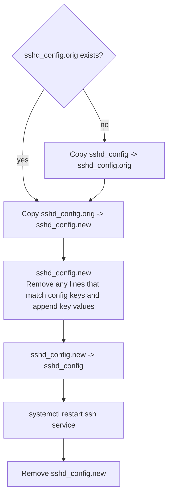

# @hanseltime/pulumi-linux

[Raw docs](./docs/)

[TODO - put your Github Pages url here](TODO)

This is a typescript collection of pulumi resources that use SSH and SFTP to establish baseline resources for a linux 
(deb/ubuntu distro) machine that you are able to SSH into.

## Note about resources

Since this is not an outright provider, this is only guaranteed to work via `npm/yarn/pnpm install` and inclusion in a typescript
project at the moment.

Additionally, since this is exposing ComponentResources that wrap multiple patterns, you will want to be mindful of your resource counts.
One resource from this package can mean multiple SSH commands, SFTP commands and linode commands.  Keep in mind that pulumi cloud free only allows
200 resources, so if the constructs are using too many of those resources, you will want to use a self-hosted backend.

# Installation

As noted above, this is only guaranteed to work for typescript pulumi projects at the moment.  If you would like to test the pulumi provider
compilation and provide improvements toward that, please feel free.

Install the package and its dependencies:

```shell
# yarn
yarn add @hanseltime/pulumi-linux @pulumi/pulumi @pulumi/command

# npm
npm install @hanseltime/pulumi-liunux @pulumi/pulumi @pulumi/command

# pnpm
pnpm add @hanseltime/pulumi-linux @pulumi/pulumi @pulumi/command
```

# Resources

## About Connections

For all connections for these resources, you will need to provide SSH connection information for either the `root` user
or a user that is set up to be able to call sudo without a password.  This is because many of the commands require sudo and
cannot be interactive.

## LinuxUser

The `LinuxUser` construct effectively proxies calls to `useradd`, `usermod`, and `userdel` depending on `create`, `update`, or `delete` events during `pulumi up`.

### About a low-privileged user

A simple low-privleged user would be declared like so:

```typescript
const user1 = new LinuxUser('user1', {
    name: 'user1',
    groups: [], // It will obviously have its own user1 group, these would be extra groups
    password: config.requireSecret('user1password'),
    connection: myRootUserConnectionInfo,
})
```

This just creates a single linux user called `user1` under the presumed root user's permissions.

One thing that isn't immediately apparent, is that user1 will also have a `~/.ssh/` folder created for it but under
the ownership of the connection user (i.e. root in this circumstance).  This behavior is because we do not want to allow
someone to assume a user role and then add additional .ssh keys for their own account.  We want those regulated by something
like a declarative IAC automation that has access to the root SSH connection or an automation connection.

### Setting up some user folder

If you want to create some prebuilt folders in the user home directory, you can add the `userHomeFolders` argument:

```typescript
const user1 = new LinuxUser('user1', {
    name: 'user1',
    groups: [], // It will obviously have its own user1 group, these would be extra groups
    password: config.requireSecret('user1password'),
    userHomeFolders: ["documents", "repos", "taxfraud"]
    connection: myRootUserConnectionInfo,
})
```

### Making a user that can edit their own .ssh folder

If you are fine with your LinuxUser being able to upload their own .ssh keys, then you can specify `canEditOwnSSH`.
This is particularly critical for sommething like setting up a self-managing non-root user that has to upload new ssh
keys to itself.

```typescript
const user1 = new LinuxUser('user1', {
    name: 'user1',
    groups: [], // It will obviously have its own user1 group, these would be extra groups
    password: config.requireSecret('user1password'),
    canEditOwnSSH: true,
    connection: myRootUserConnectionInfo,
})
```

### Creating an automation user

In general, if you were going to create a user that is able to execute SSH commands for `pulumi up` but is not root. Then
you will want to ensure that we modify the user and its associated sudoers entries to allow it to be passwordless like so:

```typescript
const autoUser = new LinuxUser('autoUser', {
    name: 'autoUser',
    groups: ['sudo'],
    password: config.requireSecret('automationPassword'),
    canEditOwnSSH: true,
    passwordlessSudo: true,
    connection: myRootUserConnectionInfo,
})
```

This type of user is useful if you want to lock down the root user over SSH.  If you've ever brought up a Linode and checked
the audit logs, you may have noticed that there are scripts that try to scan for IPs and then connect via root and
password since its a simple vector to exploit.  In that case, you may want to keep a different automation user and then
turn off the root user's ability to connect via SSH (see the `SSHDConfig` resource).

Note, if you do create an automation user and want to shut off the root user, you will need to have something that will 
change the connection to use the automation user on subsequent updates so that it doesn't time out due to the root connection.
This is a novel problem that requires you storing some sort of state to know that "I've made autoUser and the ssh is no
longer allowing root, so I need to switch to the autoUser to manage myself".

## SSHDConfig

This is a simple resource that will:

1. Declaratively track your sshd configuration changes
2. Apply your sshd options over the default sshd config that was originally there
3. restart your sshd daemon so that it takes effect.

In a flow chart form, the remote command will perform the following:



Importantly, note that we always keep a `.orig` copy of the sshd file that was present at the time of initial
creation of this resource.  This means that we always keep the minimum default values and only perform overrides
for your config.  It does mean that, if you have a value you want to explicitly set, set if via the configuration.

### Usage

The following usage creates an sshd_config that only allows private key logins and does not allow root login

```typescript
		const sshdUpdate = new SSHDConfig(
			`${name}-sshd-update`,
			{
				connection: myAutomationUserConnectionInfo,
				config: {
					PermitRootLogin: "no",
					PasswordAuthentication: "no",
                    // Any defaults are mapped
				},
			},
			{
				parent: this,
				dependsOn: [myAutomationUser],
			},
		);
```

#### About Types

At the moment, we do not encode sshd config keys into the config option.  Please make sure that you are using the correct
option that you would put in an sshd config file.

## SudoCopyToRemote

The `@pulumi/command` library already has a `CopyToRemote` resource that will perform an SFTP upload under the provided
connection user to a location.  However, the current resource does not have a way to access uploads to anything that would
be under `root` without having the connection for root supplied.  This can be a problem if you have decided that you don't
want to leave root open over SSH and have gone the route of adding an automation user that can sudo without entering its
password.

If you are using an automation user that is not root, the `CopyToRemote` command will not be able to actually access root
or other user directories since it cannot apply sudo when doing an SFTP operation.

In these scenarios, you will want to use `SudoCopyToRemote`, which will:

1. Upload all files to a cleaned temporary directory for the current connection user
2. Copy all of those files via sudo to the expected remote location
3. Remove all temporary files

### Usage

The most common use case for this is when adding an automation user and then using that automation user
to copy to some root location.

The following example shows the creation of the automation user, a temp directory for uploads, and then
how you would use it when setting up `SudoCopyToRemote`. Note that the actual asset and connection are
stubbed.

```typescript

const autoUser = new LinuxUser('autoUser', {
    name: 'autoUser',
    groups: ['sudo'],
    password: config.requireSecret('automationPassword'),
    canEditOwnSSH: true,
    passwordlessSudo: true,
    connection: myRootUserConnectionInfo,
    userHomeFolders: ["sudo-copy-tmp"], // Create a folder for temp uploads
})

// Create a copyable asset
const etcDockerCopyable = new CopyableAsset(/** Asset info */)

const copyADaemonFile = SudoCopyToRemote(				
    `${name}-daemonconfig`,
    {
        source: etcDockerCopyable.copyableSource,
        remotePath: "/etc",
        connection: automatoinUserConnection,
        triggers: etcDockerCopyable.copyableSource,
        userTmpPath: automationUser.homeDir.apply(
                (homeDir) => `${homeDir}/sudo-copy-tmp`,
            ),
    }
)

```
